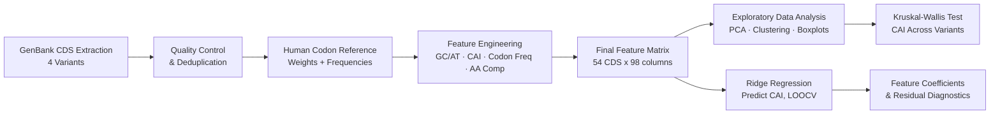

<p align="center">

</p>

# CodonAdapt-CoV: Quantitative Characterization and Predictive Modeling of Codon Usage Bias in SARS-CoV-2 Variants for mRNA Vaccine Design

<p align="center">


</p>

<br>

*An in silico research project applying computational sequence analysis, exploratory statistics, and supervised machine learning to characterize how well SARS-CoV-2 variant coding sequences are adapted to human codon usage, and to test whether this adaptation can be predicted from simpler sequence composition features, motivated by the role of codon adaptation in mRNA vaccine antigen design.*

---

# 📑 Table of Contents

- <a href="#research-question">Research Question</a>
- <a href="#project-overview">Project Overview</a>
- <a href="#dataset">Dataset</a>
- <a href="#repository-structure">Repository Structure</a>
- <a href="#pipeline-overview">Pipeline Overview</a>
- <a href="#tools--libraries">Tools & Libraries</a>
- <a href="#part-1-sequence-processing--qc">Part 1: Sequence Processing & Quality Control</a>
- <a href="#part-2-feature-engineering">Part 2: Feature Engineering</a>
- <a href="#part-3-exploratory-data-analysis">Part 3: Exploratory Data Analysis</a>
- <a href="#part-4-statistical-testing">Part 4: Statistical Testing</a>
- <a href="#part-5-machine-learning">Part 5: Machine Learning (Predicting CAI)</a>
- <a href="#final-results">Final Results Summary</a>
- <a href="#key-finding">Key Finding</a>
- <a href="#limitations">Limitations</a>
- <a href="#future-work">Future Work</a>
- <a href="#license">License</a>
- <a href="#author--contact">Author & Contact</a>

---

## <a id="research-question"></a>❓ Research Question

> Can codon usage bias and adaptation of SARS-CoV-2 variant coding sequences to the human host be quantitatively characterized using compositional and codon-level features, and can these features predict the Codon Adaptation Index (CAI), a key determinant of translational efficiency relevant to mRNA vaccine antigen design?

---

## <a id="project-overview"></a>📖 Project Overview

This project develops a computational pipeline to analyze codon usage bias in SARS-CoV-2 variants. It extracts coding sequences from GenBank records for the original, Beta, Delta, and Omicron variants, evaluates human codon adaptation using CAI and related metrics, compares codon usage across variants, and uses regression to assess whether CAI can be predicted from simple sequence composition features.

---

## <a id="dataset"></a>🧬 Dataset

| Variant | Genomes Used | Unique CDS Retained |
|---|---|---|
| COVID_19 (original lineage) | 3 (incl. reference NC_045512.2) | 12 |
| Beta_strain (B.1.351) | 2 | 14 |
| Delta_strain (AY.116) | 2 | 11 |
| Omicron_strain (BA.1.x) | 4 | 17 |
| **Total unique CDS** | **11 genomes** | **54** |

A human reference codon usage table (`Homo_sapiens_codon_usage.csv`) and a set of human CDS sequences (`cds_from_genomic.fna`, 99,326,050 total sense codons) were used to compute host-adaptation weights and reference codon frequencies.

---

## <a id="repository-structure"></a>📁 Repository Structure

```bash
codonadapt-cov/
├── Data/
├── Figures/
├── Metadata.csv
├── Feature_Matrix_Final.csv
├── Ridge_Feature_Coefficients.csv
├── mRNA.py
├── requirements.txt
└── README.md
```

<details>
<summary>Click to expand full structure</summary>

```bash
codonadapt-cov/
├── Data/
│   ├── COVID_19_Complete_Sequence.gb
│   ├── COVID_19_Extra1_OV093088.1.gb
│   ├── COVID_19_Extra2_OU161735.1.gb
│   ├── Omicron_Strain_Complete_Sequence.gb
│   ├── Omicron_Strain_Extra1_OR529199.1.gb
│   ├── Omicron_Strain_Extra2_ON115270.1.gb
│   ├── Omicron_Strain_Extra3_ON115272.1.gb
│   ├── Beta_Strain_Complete_Sequence.gb
│   ├── Beta_Strain_Extra1_OR936719.gb
│   ├── Delta_Strain_Complete_Sequence.gb
│   ├── Delta_Strain_Extra1_OR936720.1.gb
│   ├── Homo_sapiens_codon_usage.csv
│   └── cds_from_genomic.fna
├── Figures/
│   ├── CAI_Boxplot.png
│   ├── GC_Content_Boxplot.png
│   ├── AT_Content_Boxplot.png
│   ├── Codon_Bias_Heatmap.png
│   ├── Feature_Correlation_Heatmap.png
│   ├── Hierarchical_Clustering.png
│   ├── PCA_Plot.png
│   ├── PCA_Plot_Codon_Usage.png
│   ├── Hierarchical_Clustering_Codon_Usage.png
│   ├── Amino_Acid_Composition.png
│   ├── CAI_Distribution_Histogram.png
│   ├── Predicted_vs_Actual_CAI.png
│   └── Residuals_vs_Predicted.png
├── Metadata.csv
├── Feature_Matrix_Final.csv
├── Ridge_Feature_Coefficients.csv
├── mRNA.py
└── README.md
```

</details>

---

## <a id="pipeline-overview"></a>🔄 Pipeline Overview



---

## <a id="tools--libraries"></a>🛠️ Tools & Libraries

| Category | Tools & Libraries |
|---|---|
| **Sequence Parsing** | Biopython (`SeqIO`, `Bio.Data.CodonTable`) |
| **Numerical Processing** | NumPy, Pandas |
| **Visualization** | Matplotlib, Seaborn |
| **Statistics** | SciPy (`kruskal`, `jensenshannon`, `linkage`/`dendrogram`) |
| **Machine Learning** | scikit-learn (Ridge Regression, PCA, StandardScaler, ColumnTransformer, Pipeline, LeaveOneOut) |

---

## <a id="part-1-sequence-processing--qc"></a>🔬 Part 1: Sequence Processing & Quality Control

Each GenBank file was parsed feature-by-feature, retaining only `CDS` regions. Every candidate sequence was validated for: only A/T/G/C bases, length divisible by 3, a valid ATG start codon, a valid terminal stop codon, and no internal stop codons.

**QC correctly rejected 4 malformed CDS regions**, confirming the validation logic works as intended rather than silently passing corrupted sequences through:

| Source Genome | Rejection Reason |
|---|---|
| Omicron (OM095411.1) | Invalid bases: R (ambiguity code) |
| Beta (OR936719.1) | Invalid bases: N |
| Delta (OR936720.1) | Length not divisible by 3 |
| Delta (OR936720.1) | Invalid bases: N |

After deduplication (11 cross-dataset duplicates removed, mainly conserved genes shared across variants), **54 unique, validated CDS sequences** remained across the four variant groups.

---

## <a id="part-2-feature-engineering"></a>🧪 Part 2: Feature Engineering

For every retained CDS, the following were computed:

- **Nucleotide composition:** GC content, AT content, GC skew, AT skew
- **Codon Adaptation Index (CAI):** computed against human host codon usage weights
- **Codon usage divergence:** Jensen–Shannon Divergence (JSD) and similarity vs. the human reference codon distribution
- **Codon usage entropy**, unique codon fraction, most frequent codon fraction
- **Full codon frequency profile** (61 sense codons, expanded into individual numeric columns)
- **Amino acid composition** (20 standard amino acids, expanded into individual numeric columns)

This produced a single, fully numeric **Final Feature Matrix** (54 rows × 98 columns), with every sequence's translated protein verified to exactly match its original GenBank-annotated protein sequence before inclusion.

---

## <a id="part-3-exploratory-data-analysis"></a>📊 Part 3: Exploratory Data Analysis

1. **Compositional boxplots (CAI, GC content, AT content):** All four variants show heavily overlapping medians and interquartile ranges, with no variant standing out as systematically higher or lower.

2. **CAI distribution histogram:** All four variants cluster around CAI ≈ 0.62–0.66, with substantial overlap in their density curves.

3. **Feature correlation heatmap:** GC content and AT content are perfectly inversely correlated (−1.00, expected by definition). `Codon_usage_similarity`, `Codon_usage_entropy`, and `Unique_codon_fraction` are almost perfectly correlated with one another (r = 0.97–0.99), indicating they capture largely overlapping information. `AT_skew` and `CAI` show the strongest correlation among independent features (r = 0.81).

4. **PCA (scalar summary features):** The first two principal components explain **82.7%** of total variance (PC1 = 59.6%, PC2 = 23.1%). Points cluster tightly by *gene identity* across all four variant colors, rather than separating by variant.

5. **PCA (full 61-codon frequency space):** the first two components explain **42.7%** of variance (PC1 = 23.4%, PC2 = 19.4%), lower than the scalar PCA, as expected given the much higher dimensionality, but the same gene-driven clustering pattern (not variant-driven) is visible.

6. **Hierarchical clustering (codon usage profile):** The dendrogram splits sequences predominantly by gene identity; a small subset of same-variant sequences does form tight, low-distance pairings (e.g., a cluster of Beta/Omicron and a cluster of Delta sequences), a modest but real signal worth noting.

7. **Codon usage bias vs. human reference (heatmap):** All four variants show near-identical row patterns, consistently favoring codons like GTT, CTT, and disfavoring CTG, GAG relative to the human host, indicating this bias is a virus-wide trait rather than variant-specific.

8. **Amino acid composition:** Near-identical bar heights across all four variants for every amino acid, with Leucine (L) the most abundant (~11–12%) in all groups; wide error bars reflect gene-to-gene variation rather than variant differences.

---

## <a id="part-4-statistical-testing"></a>📉 Part 4: Statistical Testing

A Kruskal-Wallis H-test (non-parametric, chosen due to no assumption of normality) was used to test whether CAI differs significantly across the four variants:

| Metric | Value |
|---|---|
| H-statistic | 0.9412 |
| p-value | 0.8155 |
| Result | Not statistically significant (p ≥ 0.05) |

**Interpretation:** No statistically significant difference in CAI was detected across COVID_19, Beta, Delta, and Omicron variants. Given the modest sample size (11–17 sequences per group), this result should be read as "no significant difference detected" rather than definitive proof of equivalence, though it is consistent with every visual pattern observed across the EDA (overlapping boxplots, gene-driven rather than variant-driven PCA/clustering, nearly identical codon bias profiles).

---

## <a id="part-5-machine-learning"></a>🤖 Part 5: Machine Learning (Predicting CAI)

**Goal:** Test whether CAI can be reliably predicted from basic, non-circular sequence composition features (i.e., features not mathematically derived from the codon-count data that CAI itself is calculated from).

**Model:** Ridge Regression, with amino acid composition compressed via PCA (3 components) inside a `ColumnTransformer`/`Pipeline`, validated using **Leave-One-Out Cross-Validation (LOOCV)**, appropriate for a dataset having a small size (n = 54).

**Input features:** `GC_content`, `GC_skew`, `AT_skew`, `Length`, and 20 amino acid composition columns (compressed to 3 PCA components). Codon-frequency-derived features (e.g., `Freq_*`, `Codon_usage_similarity`, `Codon_usage_entropy`) were deliberately excluded to avoid circularity, since these are used directly in CAI's own calculation.

### Regularization Tuning

| Alpha (α) | R² | RMSE | MAE |
|----------:|----:|-----:|----:|
| 0.01      | 0.9475 | 0.0051 | 0.0066 |
| 0.1       | 0.9481 | 0.0051 | 0.0065 |
| 1.0       | 0.9473 | 0.0050 | 0.0066 |
| 10        | 0.9285 | 0.0051 | 0.0077 |
| 50        | 0.8829 | 0.0067 | 0.0098 |
| 100       | 0.8240 | 0.0082 | 0.0120 |


`alpha = 0.1` was selected as the final model, producing the highest R² and lowest RMSE among tested values.

### Does Variant Identity Improve the Model?

| Model | R² | MAE | RMSE |
|---|---|---|---|
| Composition-only (baseline) | **0.9481** | **0.0051** | **0.0065** |
| Composition + variant (one-hot) | 0.9418 | 0.0054 | 0.0069 |

Adding variant identity **slightly worsened** every metric, indicating variant identity provides no additional predictive value beyond sequence composition — an independent, model-based confirmation of the same conclusion drawn from the Kruskal-Wallis test and EDA above.

### Feature Coefficients (Final Model)

| Feature | Coefficient | Direction of Effect on CAI |
|---|---|---|
| Amino acid composition (PC1) | −0.0128 | Negative |
| AT_skew | −0.0126 | Negative |
| Amino acid composition (PC0) | +0.0117 | Positive |
| GC_skew | −0.0106 | Negative |
| Length | +0.0042 | Positive (weak) |
| GC_content | −0.0026 | Negative (weak) |
| Amino acid composition (PC2) | +0.0023 | Positive (weak) |

Nucleotide skew (AT_skew, GC_skew) and amino acid usage patterns (captured by the top two PCA components) emerged as the strongest predictors of CAI in this dataset.

### Model Diagnostics

- **Predicted vs. Actual CAI:** Points closely track the diagonal "perfect prediction" line across the full CAI range (0.56–0.70), visually confirming the strong R².
- **Residuals vs. Predicted CAI:** Residuals scatter around zero without a funnel or curved pattern, indicating no systematic bias across the prediction range. One sequence (predicted CAI ≈ 0.565) showed a larger positive residual (~+0.017), a mild outlier consistent with natural variability at this sample size.

---

## <a id="final-results"></a>📊 Final Results Summary

| Analysis | Result |
|---|---|
| Unique validated CDS | 54 (across 4 variants, 11 genomes) |
| CAI difference across variants (Kruskal-Wallis) | Not significant (p = 0.8155) |
| PCA variance explained (scalar features) | 82.7% (2 components) |
| PCA variance explained (codon usage space) | 42.7% (2 components) |
| Best CAI regression model | Ridge (α = 0.1), R² = 0.9481, RMSE = 0.0065 |
| Does variant identity improve prediction? | No (R² drops to 0.9418) |
| Strongest CAI predictors | AT_skew, GC_skew, amino acid composition (PC0/PC1) |

---

## <a id="key-finding"></a>🌟 Key Finding

CAI does not differ significantly among the four SARS-CoV-2 variants, as supported by visualization, the Kruskal-Wallis test, and machine learning analysis. CAI is also predicted accurately from basic sequence composition features, with an LOOCV-validated R² of 0.9481. These findings suggest that codon adaptation is a virus-wide, composition-linked property rather than a variant-specific feature, supporting rapid CAI estimation for mRNA vaccine antigen screening.

---

## <a id="limitations"></a>⚠️ Limitations

- The dataset is modest, with 54 CDS from 11 genomes, limiting statistical power.
- Each variant has only 2 to 4 independent genomes, which limits generalizability.
- LOOCV supports internal validation, but performance on novel or highly divergent sequences remains untested.

---

## <a id="future-work"></a>🚀 Future Work

- Include more independent genomes from each variant.
- Test the regression model across other coronaviruses and RNA viruses.
- Develop synonymous codon optimization while preserving the encoded protein.
- Evaluate non-linear models such as random forest and gradient boosting.

---

## <a id="license"></a>📄 License

This project is licensed under the [MIT License](https://github.com/genome-miner/sars-cov2-codon-adaptation/blob/main/LICENSE).

---

## <a id="author--contact"></a>👨‍💻 Author & Contact

**Sana Aziz Sial**  
Biotechnologist and Bioinformatician
- 🎓 [University of Veterinary and Animal Sciences](https://www.uvas.edu.pk/)
- 📧 [Email](sanaazizsial@gmail.com)
- 🐙 [GitHub](https://github.com/genome-miner)
- 🔗 [LinkedIn](in/sana-aziz-sial-73b189265)

## ⭐ Support the Project

_If you found this repository useful, whether for its methodology, results, or as a reference for your own mRNA project, consider giving it a **star**._

_Thank you for visiting!_
</div>

<p align="center">

</p>
